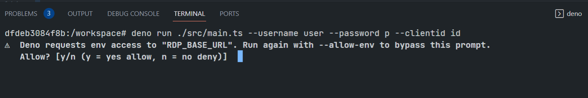

# Developing JavaScript HTTP REST API application with Deno runtime.
- version: 1.0
- Last update: August, 2022
- Environment: Deno runtime and Docker
- Prerequisite: [Access to RDP credentials](#prerequisite)

Example Code Disclaimer:
ALL EXAMPLE CODE IS PROVIDED ON AN “AS IS” AND “AS AVAILABLE” BASIS FOR ILLUSTRATIVE PURPOSES ONLY. REFINITIV MAKES NO REPRESENTATIONS OR WARRANTIES OF ANY KIND, EXPRESS OR IMPLIED, AS TO THE OPERATION OF THE EXAMPLE CODE, OR THE INFORMATION, CONTENT, OR MATERIALS USED IN CONNECTION WITH THE EXAMPLE CODE. YOU EXPRESSLY AGREE THAT YOUR USE OF THE EXAMPLE CODE IS AT YOUR SOLE RISK.

## <a id="project_structure"></a> Project Structure Overview

This example project is a TypeScript console application that login to the RDP platform, then requests the Chain data and PermID information from the RDP Pricing-Chain and Symbology services respectively. The project source code are as follows:

* src/main.ts: The main console application class.
* src/rdp_https.ts: The main RDP HTTP operations class.
* src/rdp_types.ts: The Type Aliases file.

### <a id="ts_main_file"></a>Main Application Code Introduction

Let me start by explaining the ```main.ts``` file code overview. It is the main application class that receives a user input for RDP credentials and a chain symbol name. Then it authenticates and gets data from the RDP RDP services, and displays that data in a console. The file contains the ```Application``` class that manages all application logic such as receiving user input information, format, and display data.

The overview code structure of the file is shown below.

```
// main.ts

// Deno STD libraries
import { parse } from "https://deno.land/std@0.150.0/flags/mod.ts";

// Import RDPController class for HTTP operations
import { RDPController } from "./rdp_https.ts";

// Importing Types
import {
  RDP_AuthToken_Type,
  RDP_ResSymbology_Table_Type,
} from "./rdp_types.ts";

// Main Application Logic class
class Application {

  //RDP Token Auth object
  rdpAuthObj: RDP_AuthToken_Type = {
    access_token: "",
    refresh_token: "",
    expires_in: "",
    scope: "",
    token_type: "",
  };

  //RDP HTTP Controller class
  rdpHTTPApp: RDPController;

  itemName: string;

  //RDP Credentials
  username: string;
  password: string;
  clientid: string;
  limit: number;

  constructor(
    username: string,
    password: string,
    clientid: string,
    itemName: string,
    limit: number
  ) {
    this.username = username;
    this.password = password;
    this.clientid = clientid;
    this.itemName = itemName;
    this.limit = limit;

    this.rdpHTTPApp = new RDPController();
  }
  
  //Main run function
  run = async () => {
    //Get RDP authentication, get and display data from RDP.
    try {
      //Send authentication request
      this.rdpAuthObj = await this.rdpHTTPApp.authenticationRDP(
        this.username,
        this.password,
        this.clientid,
        this.rdpAuthObj.refresh_token,
      );
      // Get RDP Data
      ....
    } catch (error) {
      //console.log(error);
      this.logger.error(error);
      Deno.exit(1);
    }
  };
  ...
};

// ---------------- Main Function ---------------------------------------- //


//Parsing command line arguments
const flags = parse(Deno.args, {
  string: ["username", "password", "clientid", "chainric"],
  boolean: ["debug"],
  default: { chainric: ".AV.O", limit: 10, debug: false },
});

...

const app = new Application(
  flags.username,
  flags.password,
  flags.clientid,
  flags.chainric,
  flags.limit as number,
  flags.debug,
);
// Running the application
app.run();

```

You may be noticed that the code uses [Deno:/flags​/mod.ts module](https://doc.deno.land/https://deno.land/std@0.120.0/flags/mod.ts) for parsing command line arguments to get information from users such as the RDP credentials, chain ric, debug flag, etc. You can find more detail about the Deno command line arguments feature from [Deno: Command Line Arguments example](https://examples.deno.land/command-line-arguments) page.

### <a id="ts_rdp_http_file"></a>RDP HTTP Class Code Introduction

Now let me turn to the ```rdp_https.ts``` file which is the main RDP HTTP operations class. It manages all request-response messages between the application and the RDP services (Authentication, Pricing, and Symbology). 

The overview code structure of the file is shown below.

```
// rdp_https.ts

// Importing Types
import {
  RDP_AuthToken_Type,
  RDP_reqAuthRevoke_Type,
  RDP_ReqSymbology_Type,
} from "./rdp_types.ts";

// A Class that handles all HTTP operations.
export class RDPController {
  ...
  // Send HTTP Post request to get Access Token (Password Grant and Refresh Grant) from RDP Auth Service
  authenticationRDP = async (...) => {
    ...
  };

  // Request Chain Data from RDP Pricing Service
  getChain = async (symbol: string, access_token: string) => {
    ...
  };

  // Request Symbology Lookup Data from RDP Symbology Lookup Service
  getSymbology = async (symbols: string[], access_token: string) => {
    ...
  };
  ...
};
```

### <a id="ts_type_aliases"></a>RDP Type Aliases Code Introduction

Type Aliases is one of [TypeScript Object Types](https://www.typescriptlang.org/docs/handbook/2/objects.html) that helps developers type-checking their variables and data in the implementation time to avoid data type errors in a final JavaScript application. 

This example project defines all Type Aliases for the RDP API's JSON request messages (for Auth and Symbology Discover services) and objects used by the application in the ```rdp_types.ts``` file.

```
//rdp_types.ts

// Types for RDP Authentication (success) response message
export type RDP_AuthToken_Type = {
  access_token: string;
  refresh_token: string;
  expires_in: string;
  scope: string;
  token_type: string;
};


// Type for RDP Auth Revoke Token (v1) request message
export type RDP_reqAuthRevoke_Type = {
  token: string;
};

// Type for RDP Symbology Lookup request message
export type RDP_ReqSymbology_Type = {
  from: RDP_Symbology_From_Type[];
  to: RDP_Symbology_To_Type[];
  reference: string[];
  type: string;
};

...
```
That covers the classes and project structure overview.

## <a id="rdp_workflow"></a>RDP APIs Application Workflow

Now, what about the API workflow? Refinitiv Data Platform entitlement check is based on OAuth 2.0 specification. The first step of an application workflow is to get a token from RDP Auth Service, which will allow access to the protected resource, i.e. data REST API. 

The API requires the following access credential information:
- Username: The username. 
- Password: Password associated with the username. 
- Client ID: This is also known as ```AppKey```, and it is generated using an App key Generator. This unique identifier is defined for the user or application and is deemed confidential (not shared between users). The client_id parameter can be passed in the request body or as an “Authorization” request header that is encoded as base64.

Once the authentication success, the function gets the RDP Auth service response message and keeps the following RDP token information in the variables.
- **access_token**: The token used to invoke REST data API calls as described above. The application must keep this credential for further RDP APIs requests.
- **refresh_token**: Refresh token to be used for obtaining an updated access token before expiration. The application must keep this credential for access token renewal.
- **expires_in**: Access token validity time in seconds.

Next, after the application received the Access Token (and authorization token) from RDP Auth Service, all subsequent REST API calls will use this token to get the data. 


Please find more detail regarding RDP APIs workflow in the following resources:
- [RDP APIs: Introduction to the Request-Response API](https://developers.refinitiv.com/en/api-catalog/refinitiv-data-platform/refinitiv-data-platform-apis/tutorials#introduction-to-the-request-response-api) page.
- [RDP APIs: Authorization - All about tokens](https://developers.refinitiv.com/en/api-catalog/refinitiv-data-platform/refinitiv-data-platform-apis/tutorials#authorization-all-about-tokens) page.

## <a id="rdp_authen"></a>RDP APIs Authentication

Let’s start with the authentication source code implementation in more detail with Deno. Please note that we are focusing on the ```rdp_https.ts``` controller class here.

### Initialize Code

Firstly, we import and crate all necessary types, objects, and variables for the API endpoints in the main application files. 

```
// rdp_https.ts

import {
  RDP_AuthToken_Type
} from "./rdp_types.ts";

// A Class that handles all HTTP operations.
export class RDPController {
  //Set Up HTTP APIs URLs
  readonly rdpServer: string = Deno.env.get("RDP_BASE_URL") ||
    "https://api.refinitiv.com";
  readonly rdpAuthURL: string = Deno.env.get("RDP_AUTH_URL") ||
    "/auth/oauth2/v1/token";
  
  constructor() {
  }
}
```

You may be noticed that the code imports Types (and class files) directly from the relative path using ES Modules syntax. Deno supports the absolute path and HTTPS URLs too.

My next point is the environment variable which is used for setting the API endpoints at run time. Deno lets developers access environment variables via the ```Deno.env``` object. Please note that access to environment variables is only possible if the Deno process is running with the **--allow-env** env var permissions flag.

If you run this example code without --allow-env flag, Deno automatics prompt that the code needs environment variables access and asks to confirm if you want to proceed as follows:



You can find more detail about Deno features above from the following resources:
* [Deno: Importing & Exporting example](https://examples.deno.land/import-export)
* [Deno: Environment Variables example](https://examples.deno.land/environment-variables)
* [Deno: Permissions document](https://deno.land/manual@v1.24.3/getting_started/permissions)

### Sending Authentication Request with Fetch API

That brings us to the ```rdp_https.ts``` that sends and receives HTTP messages with RDP APIs. We create a function named ```authenticationRDP``` in a file to send a login request message to the RDP Auth Token service. The function creates the authentication request message as a form *x-www-form-urlencoded* format and then sends it to the RDP via native Fetch API as an HTTP POST message.

```
// rdp_https.ts

import {
  RDP_AuthToken_Type
} from "./rdp_types.ts";

// A Class that handles all HTTP operations.
class RDPController {
  //Set Up HTTP APIs URLs
  readonly rdpServer: string = Deno.env.get("RDP_BASE_URL") ||
    "https://api.refinitiv.com";
  readonly rdpAuthURL: string = Deno.env.get("RDP_AUTH_URL") ||
    "/auth/oauth2/v1/token";
  
  constructor() { }
  // Send HTTP Post request to get Access Token (Password Grant and Refresh Grant) from RDP Auth Service
  authenticationRDP = async (
    username: string,
    password: string,
    client_id: string,
    refresh_token: string
  ): Promise<RDP_AuthToken_Type> => {

    // Set Up RDP Auth Token additional params .
    const scope = "trapi";
    const takeExclusiveSignOnControl = true;

    if (
      username.length === 0 || password.length === 0 || client_id.length === 0
    ) {
      throw new Error("Received invalid (None or Empty) arguments");
    }

    const authenURL = `${this.rdpServer}${this.rdpAuthURL}`;
    console.log(`Requesting Authenticaion Token from ${authenURL}`);

    let authReqMsg = "";
    //Init Authentication Request Message and First Login scenario
    authReqMsg = `username=${username}&client_id=${client_id}&password=${password}&scope=${scope}&grant_type=password&takeExclusiveSignOnControl=${takeExclusiveSignOnControl}`;
   
    ...

    // Send HTTP Request
    const response: Response = await fetch(authenURL, {
      method: "POST",
      headers: {
        "Content-Type": "application/x-www-form-urlencoded",
      },
      body: new URLSearchParams(authReqMsg),
    });

    if (!response.ok) {
      console.log("Authentication Failed");
      const statusText: string = await response.text();
      throw new Error(`HTTP error!: ${response.status} ${statusText}`);
    }
    console.log("Authentication Granted");
    return await response.json();
  };
}
```
That brings us to other Deno security behaviors, Deno does not let the application access network by default. You need to specifically set the **--allow-net** permission flag to enable network access. If you run this example code without the **--allow-net** flag, Deno automatics prompt that the code needs network access and asks to confirm if you want to proceed as follows:


If the authentication is successful, the function returns the authentication information (*access token*, *refresh token*, etc.) as a JSON message (with ```RDP_AuthToken_Type``` type) to the caller. If the authentication fails, throws the errors as an exception event.


You can find more detail about Deno features above from the following resources:
* [Deno: HTTP Requests example](https://examples.deno.land/http-requests)
* [Deno: Fetch data document](https://deno.land/manual@v1.24.3/examples/fetch_data)
* [Deno: Permissions document](https://deno.land/manual@v1.24.3/getting_started/permissions)

That’s all I have to say about the authentication part.

## <a id="rdp_get_data"></a>Requesting RDP APIs Data

That brings us to requesting the RDP APIs data. All subsequent REST API calls use the Access Token via the *Authorization* HTTP request message header as shown below to get the data. 
- Header: 
    * Authorization = ```Bearer <RDP Access Token>```

Please notice *the space* between the ```Bearer``` and ```RDP Access Token``` values.

The application then creates a request message in a JSON message format or URL query parameter based on the interested service and sends it as an HTTP request message to the Service Endpoint. Developers can get RDP APIs the Service Endpoint, HTTP operations, and parameters from Refinitiv Data Platform's [API Playground page](https://api.refinitiv.com/) - which is an interactive documentation site developers can access once they have a valid Refinitiv Data Platform account.

This project covers the following the RDP APIs Services:
- Pricing Chain ```/data/pricing/chains/v1``` operation.
- Discovery Symbology Service ```/discovery/symbology/v1/lookup``` endpoint that navigates between identifiers.

## <a id="rdp_chain"></a>RDP APIs Pricing Chain Service

I will begin with the Chain service. The RDP ```/data/pricing/chains/<version>``` endpoint is an HTTP REST API service that returns all constituents of a Chain symbol.

### Sending Chain Request

I will begin by creating a function named ```getChain()``` in the HTTP Controller  ```rdp_https.ts``` file. This function receives a Chain symbol and the access token information to create an HTTP URL with a symbol query parameter as follows

```
// rdp_https.ts

...

// A Class that handles all HTTP operations.
class RDPController {
  //Set Up HTTP APIs URLs
  readonly rdpServer: string = Deno.env.get("RDP_BASE_URL") ||
    "https://api.refinitiv.com";
  readonly rdpChainURL: string = Deno.env.get("RDP_CHAIN_URL") ||
    "/data/pricing/chains/v1";
  
  ...

  // Request Chain Data from RDP Pricing Service
  getChain = async (symbol: string, access_token: string) => {
    
    const param = { universe: symbol };
    const chainURL = `${this.rdpServer}${this.rdpChainURL}/?${
      new URLSearchParams(param).toString()
    }`;

    console.log(`Requesting Chain Data from ${chainURL}`);
    ...
  };
  ...
}
```

Then sends it to the RDP Chain service as an HTTP *GET* operation.

```
// rdp_https.ts

...

// A Class that handles all HTTP operations.
class RDPController {

  ...

  // Request Chain Data from RDP Pricing Service
  getChain = async (symbol: string, access_token: string) => {
    
    ...
    // Send HTTP Request
    const response: Response = await fetch(chainURL, {
      method: "GET",
      headers: {
        "Content-Type": "application/json",
        "Authorization": `Bearer ${access_token}`,
      },
    });

    if (!response.ok) {
      const statusText: string = await response.text();
      throw new Error(
        `Get Chain HTTP error!: ${response.status} ${statusText}`,
      );
    }
  
    //Parse response to JSON
    return await response.json();
  };
  ...
}
```

If the request is successful, the code sends data back to a caller in a JSON message format. But if the request is failed, it throws an exception with error detail to a caller.

Example Chain response message:

```
{
  "universe": {
    "ric": "0#.SETI",
    "displayName": "SET INDEX",
    "serviceName": "ELEKTRON_DD"
  },
  "data": {
    "constituents": [
      "2S.BK",
      "3K-BAT.BK",
      "7UP.BK",
      "A.BK",
      "AAV.BK",
      ...
      "ZEN.BK"
    ]
  }
}
```
That covers the Chain data part. 

## <a id="rdp_symbology"></a>RDP APIs Symbology Discovery Service

### Sending Symbology Request to get PermID

This example converts a symbol from the RIC Code identifier to [Permanent Identifiers (PermIDs)](https://www.refinitiv.com/en/products/permid-data-management), [LEI](https://en.wikipedia.org/wiki/Legal_Entity_Identifier) using the RDP the Discovery Symbology Service. I will begin by importing the ```PDP_Symbology_Req_Type``` Type Aliases for the Symbology JSON request message, and creating a function named ```getSymbology()``` in the HTTP Controller  ```rdp_https.ts``` file. 

The steps to create the JSON request message are shown below.

```
// rdp_https.ts

// Importing Types
import {
  RDP_AuthToken_Type,
  RDP_reqAuthRevoke_Type,
  RDP_ReqSymbology_Type,
} from "./rdp_types.ts";

...

// A Class that handles all HTTP operations.
class RDPController {

  ...

  // Request Symbology Lookup Data from RDP Symbology Lookup Service
  getSymbology = async (symbols: string[], access_token: string) => {
    ...
    const symbologyURL = `${this.rdpServer}${this.rdpSymbology}`;

    console.log(`Requesting PermID Data from ${symbologyURL}`);
    // Create Symbology Request Message
    const payload: RDP_ReqSymbology_Type = {
      "from": [{
        "identifierTypes": [
          "RIC",
        ],
        "values": symbols,
      }],
      "to": [{
        "objectTypes": [
          "organization",
        ],
        "identifierTypes": [
          "PermID",
        ],
      }],
      "reference": [
        "name",
        "status",
        "classification",
      ],
      "type": "auto",
    };
    ....
  };
  ...
}
```
Then sends it to the RDP Chain service as an HTTP *POST* operation.

```
// rdp_https.ts

...

// A Class that handles all HTTP operations.
class RDPController {

  ...

  // Request Symbology Lookup Data from RDP Symbology Lookup Service
  getSymbology = async (symbols: string[], access_token: string) => {

    ...

    // Send HTTP Request
    const response: Response = await fetch(symbologyURL, {
      method: "POST",
      headers: {
        "Content-Type": "application/json",
        "Authorization": `Bearer ${access_token}`,
      },
      body: JSON.stringify(payload),
    });

    if (!response.ok) {
      const statusText: string = await response.text();
      throw new Error(
        `Get Chain HTTP error!: ${response.status} ${statusText}`,
      );
    }
    console.log("Get Symbology Data success.");
    //Parse response to JSON
    return await response.json();
  };
  ...
}
```
### Displaying Symbology Data

The next step is displaying PermIDs data in a readable format. The application uses the [console.table()](https://developer.mozilla.org/en-US/docs/Web/API/console/table) function to print data to a console in a tabular format.

Let's start by creating the new Type Aliases for the Symbology table object named ```RDP_ResSymbology_Table_Type```. This object keeps the necessary output data which are ```RIC```, and ```PermID``` fields from the response JSON message.

```
//rdp_types.ts

// Type for RDP Symbology Lookup PermIDs Valid Response message
export type RDP_ResSymbology_Table_Type = {
  data: RDP_ResSymbology_PermID_Type[];
};

// sub-Type for RDP Symbology Lookup PermIDs data
type RDP_ResSymbology_PermID_Type = {
  RIC: string;
  PermID: string;
};
```

Finally, we create a ```displayPermID()``` function in a ```main.ts``` file to construct the ```permIDDataTable``` object and then passes it to the ```console.table()``` function. 

```
// main.ts

// Import RDPController class for HTTP operations
import { RDPController } from "./rdp_https.ts";

// Importing Types
import {
  RDP_AuthToken_Type,
  RDP_ResSymbology_Table_Type,
} from "./rdp_types.ts";

// Main Application Logic class
class Application {

  ....

  //Main run function
  run = async () => {
    try {
      ....
      //Send PermIDs data request
      const permIDData = await this.rdpHTTPApp.getSymbology(
        chainData["data"]["constituents"].slice(0, this.limit),
        this.rdpAuthObj.access_token,
      );

      //Displaying PermIDs data
      this.displayPermID(permIDData);
    } catch (error) {
      console.log(error);
      Deno.exit(1);
    }
  };

  // Convert PermIDs JSON data to be a table
  displayPermID = (permIDJSON: any) => {
    const permIDData = permIDJSON["data"];

    const permIDDataTable: RDP_ResSymbology_Table_Type = { data: [] };
    let _output: string;

    permIDData.forEach((permid: any) => {
      if (permid["output"].length !== 0) {
        _output = permid["output"][0]["value"];
      } else if (permid["errors"]) {
        _output = permid["errors"][0];
      } else {
        _output = "No PermID information";
      }

      permIDDataTable["data"].push({
        RIC: permid["input"][0]["value"],
        PermID: _output,
      });
    });

    console.table(permIDDataTable["data"]);
  };
}
...
```
The ```console.table()``` result with the ```permIDDataTable``` object is as follows:


That covers the Symbology data conversion part. 

## <a id="deno_npm"></a>Using NPM modules with Deno

My next point is using the npm modules with Deno. As I have mentioned earlier, Deno supports the ES Modules system only while Node.js supports both CommonJS and ES Modules. Their internal module systems also work differently. This makes Deno not support the [npm](https://www.npmjs.com/) package eco-system and its massive libraries *as-is*. Deno lets developers access **some npm packages** via the content delivery networks (CDNs) as the remote HTTP modules. The CDNs such as [esm.sh](https://esm.sh/), [Skypack.dev](https://www.skypack.dev/), and [UNPKG](https://unpkg.com/) provide Deno friendly npm packages in the ES Module format and support Deno integration. The example usage is as follows:

```
import React from "https://esm.sh/react";

export default class A extends React.Component {
  render() {
    return <div></div>;
  }
}
```
Please note that **most Node.js and npm packages are still not compatible with Deno** even through the CDNs above. Deno team [just announced](https://deno.com/blog/changes#compatibility-with-node-and-npm) (as of August 2022) that they are working on improving Deno to be more compatible with npm packages. 

You can find more detail about Deno and npm packages from the following Deno resources:
* [Deno: Using npm/Node.js code document](https://deno.land/manual@v1.15.2/npm_nodejs)
* [Deno: Packages from CDNs document](https://deno.land/manual@v1.15.2/npm_nodejs/cdns)
* [Deno: Compatibility with Node and npm announcement](https://deno.com/blog/changes#compatibility-with-node-and-npm)

I am demonstrating Deno and npm package integration with the [Pino](https://www.npmjs.com/package/pino) logger library.

### Integrate Deno with NPM package

[Pino](https://www.npmjs.com/package/pino) is a fast and small logger library for the Node.js application. I am using this library to log debug information such as incoming and outgoing HTTP messages if the user input **--debug** argument when running the application.

I will begin by importing the Pino library as a remote HTTP module via [esm.sh](https://esm.sh/) CDN to the ```main.ts``` file. The ```Application``` class sets the Pino log level based on the user input *debug* flag when running the application. If Pino debug level is enabled, the code uses it to print response data from the RDP services.

```
// main.ts

// NPM library for logging
import pino from "https://esm.sh/pino";
...
// Main Application Logic class
class Application {
  logger: any;

  constructor(
    ...
    debug: boolean,
  ) {
    ...
    this.logger = pino({ level: debug ? "debug" : "info" });

    this.rdpHTTPApp = new RDPController(this.logger);
  }

  //Main run function
  run = async () => {
    try {
      //Send authentication request
      this.rdpAuthObj = await this.rdpHTTPApp.authenticationRDP(
        this.username,
        this.password,
        this.clientid,
        this.rdpAuthObj.refresh_token,
      );
      this.logger.debug(JSON.stringify(this.rdpAuthObj));

      //Send chain data request
      const chainData = await this.rdpHTTPApp.getChain(
        this.itemName,
        this.rdpAuthObj.access_token,
      );
      this.logger.debug(chainData);

     ...
    }
  };
}

```

On the ```RDPController``` class of the ```rdp_https.ts``` side, gets a logger object from the main app to print debug data (if enabled).

```
// rdp_https.ts

// A Class that handles all HTTP operations.
export class RDPController {
  //Logger
  logger: any;

  constructor(logger: any) {
    this.logger = logger;
  }

  // Send HTTP Post request to get Access Token (Password Grant and Refresh Grant) from RDP Auth Service
  authenticationRDP = async (
    username: string,
    password: string,
    client_id: string,
    refresh_token: string
  ): Promise<RDP_AuthToken_Type> => {
    ...
    let authReqMsg = "";
    //Init Authentication Request Message and First Login scenario
    authReqMsg = `username=${username}&client_id=${client_id}&password=${password}&scope=${scope}&grant_type=password&takeExclusiveSignOnControl=${takeExclusiveSignOnControl}`;

    this.logger.debug(
      `RDPController:authenticationRDP(): Outgoing Request Message = ${authReqMsg}`,
    );
    ...
  }
}
```

The result of debug log is shown below.

```
$>deno run --allow-env --allow-net ./src/main.ts --username $RDP_USERNAME --password $RDP_PASSWORD --clientid $RDP_APP_KEY --debug
Requesting Authentication Token from https://api.refinitiv.com/auth/oauth2/v1/token
RDPController:authenticationRDP(): Outgoing Request Message = username=XXX&client_id=XXX&password=XXXX&scope=trapi&grant_type=password&takeExclusiveSignOnControl=true
Authentication Granted
{"access_token":"XXXX","refresh_token":"YYYYYY","expires_in":"600","scope":"ZZZZZ","token_type":"Bearer"}
Requesting Chain Data from https://api.refinitiv.com/data/pricing/chains/v1/?universe=.AV.O
Expand Chain data success.
{
  universe: { ric: ".AV.O", displayName: "TOP 25 BY VOLUME", serviceName: "ELEKTRON_DD" },
  data: {
    constituents: [
      "ENDP.O", "BBIG.O", "BBBY.O",
      "EAR.O",  "CRBP.O", "TTOO.O",
      "ATHX.O", "SQQQ.O", "RDHL.O",
      "TQQQ.O", "JCSE.O", "HGEN.O",
      "FFIE.O", "GOEV.O", "GBOX.O",
      "NBEV.O", "PDD.O",  "MULN.O",
      "NEPT.O", "VS.O",   "ITRM.O",
      "MEGL.O", "TYDE.O", "QQQ.O",
      "GOCO.O"
    ]
  }
}
...
```
## <a id="devcontainer_json"></a>Setting A Devcontainer with Deno

The main configuration file that tells VS Code how to access (or create) a devcontainer with a well-defined tool and runtime stack is named the ```devcontainer.json``` file. The dev container configuration is either located under ```.devcontainer/devcontainer.json``` or stored in a file named ```.devcontainer.json``` file (*note the dot-prefix*) in the root of the project.

**Note**: Make sure to commit a ```.devcontainer``` folder to your version control system.

A ```.devcontainer/devcontainer.json``` file for Deno development is as follows:

```
{
	"name": "Deno HTTP REST Console",
	"image": "denoland/deno:alpine-1.24.3",
	"customizations": {
		// Configure properties specific to VS Code.
		"vscode": {
			"settings": {"deno.enable": true},
			"extensions": [
				"denoland.vscode-deno"
			]
		}
	},
	"runArgs": [
        "--env-file=.devcontainer/.env.devcontainer"
    ],
	"workspaceMount": "source=${localWorkspaceFolder},target=/workspace,type=bind",
	"workspaceFolder": "/workspace",
	"shutdownAction":"stopContainer"
}

```
The detail of the configurations above are:
- ```name```: A display name for the container.
- ```image```: Pull "denoland/deno:alpine-1.24.3" Docker image from DockerHub [https://hub.docker.com/r/denoland/deno](https://hub.docker.com/r/denoland/deno) URL.
- ```customizations.vscode.settings```: Set *default* container specific settings.json values on container create to enable Deno extensions.
- ```customizations.vscode.extensions```: Specify VS Code extension IDs that will be installed inside the container. I am setting the [Deno extension for Visual Studio Code](https://marketplace.visualstudio.com/items?itemName=denoland.vscode-deno) here.
- ```runArgs```: An array of [Docker CLI arguments](https://docs.docker.com/engine/reference/commandline/run/) that VS Code uses when running the container. I am setting the ```--env-file``` option that sets the container's environment variables via a file named *.env.devcontainer*.
- ```workspaceMount```: Overrides the default local mount point for the workspace when the container is created. 
- ```workspaceFolder```: Sets the default path that VS Code should open when connecting to the container. 
- ```shutdownAction```: set the VS Code stops the container when the editor window is closed/shut down.

Please find more details about all devcontainer.json configuration parameters on the [VS Code - devcontainer.json reference](https://code.visualstudio.com/docs/remote/devcontainerjson-reference) page.

That’s all I have to say about developing HTTP REST API console application with Deno.

## <a id="how_to_run"></a>How to run the example project

Please see how to run the project test suit in the [README.md](README.md#how_to_run) file.

## <a id="references"></a>References

For further details, please check out the following resources:

* [Refinitiv Data Platform APIs page](https://developers.refinitiv.com/en/api-catalog/refinitiv-data-platform/refinitiv-data-platform-apis) on the [Refinitiv Developer Community](https://developers.refinitiv.com/) website.
* [Refinitiv Data Platform APIs Playground page](https://api.refinitiv.com).
* [Refinitiv Data Platform APIs: Introduction to the Request-Response API](https://developers.refinitiv.com/en/api-catalog/refinitiv-data-platform/refinitiv-data-platform-apis/tutorials#introduction-to-the-request-response-api).
* [Refinitiv Data Platform APIs: Authorization - All about tokens](https://developers.refinitiv.com/en/api-catalog/refinitiv-data-platform/refinitiv-data-platform-apis/tutorials#authorization-all-about-tokens).
* [Limitations and Guidelines for the RDP Authentication Service](https://developers.refinitiv.com/en/article-catalog/article/limitations-and-guidelines-for-the-rdp-authentication-service) article.
* [Getting Started with Refinitiv Data Platform](https://developers.refinitiv.com/en/article-catalog/article/getting-start-with-refinitiv-data-platform) article.
* [Deno official website](https://deno.land/).
* [Deno by example](https://examples.deno.land/) webpage.
* [Deno official document](https://deno.land/manual) page.
* [Deno: Permissions document](https://deno.land/manual@v1.24.3/getting_started/permissions) page.
* [Deno DockerHub](https://hub.docker.com/r/denoland/deno) page.
* [Running Deno in Docker](https://medium.com/deno-the-complete-reference/running-deno-in-docker-35756ffff66d) blog post.
* [Deno World](https://medium.com/deno-the-complete-reference?source=post_page-----dcf518948a9d--------------------------------) blog series.

For any questions related to Refinitiv Data Platform APIs, please use the [RDP APIs Forum](https://community.developers.refinitiv.com/spaces/231/index.html) on the [Developers Community Q&A page](https://community.developers.refinitiv.com/).