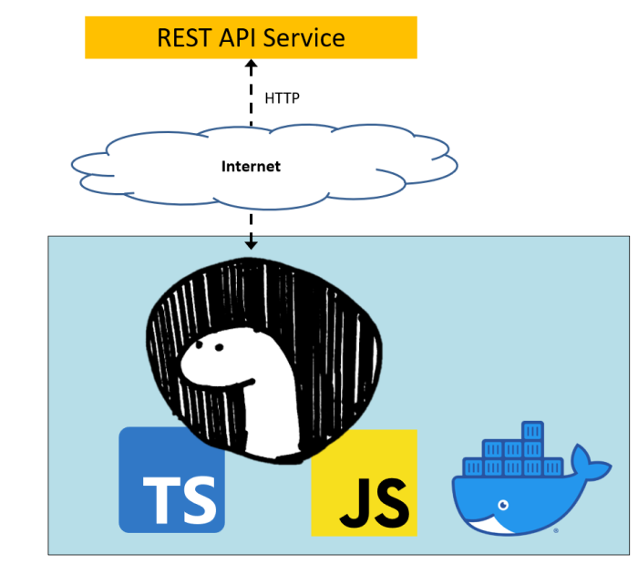
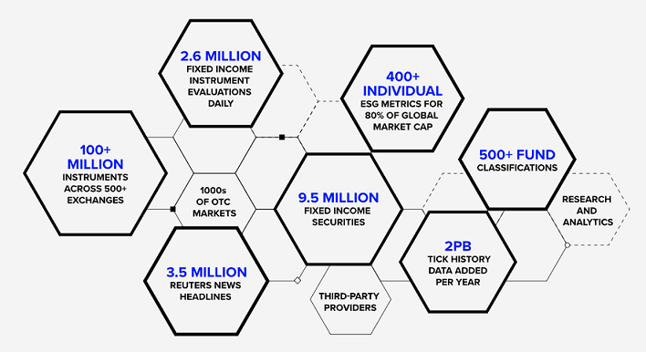
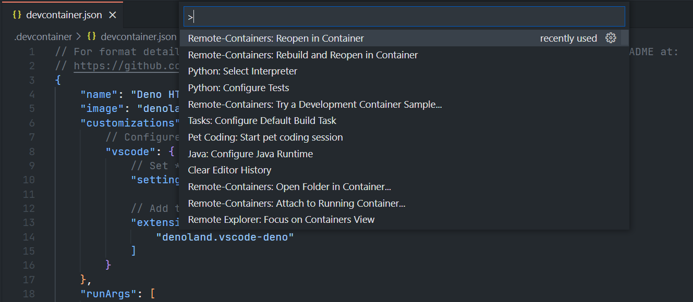
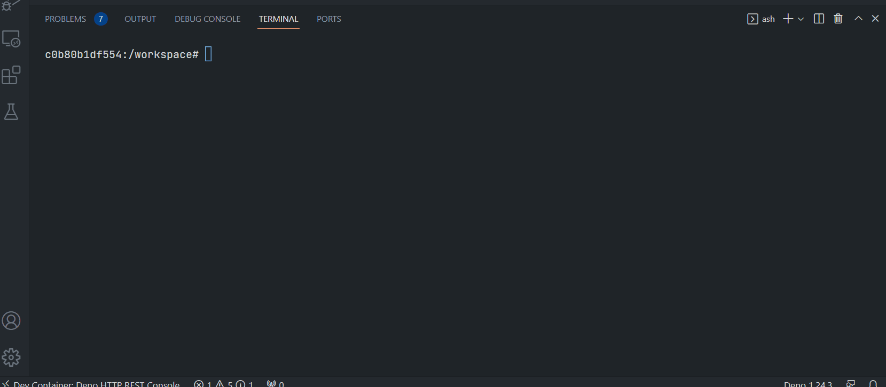

# Developing TypeScript HTTP REST API application with Deno runtime.
- version: 1.0
- Last update: August, 2022
- Environment: Deno runtime and Docker
- Prerequisite: [Access to RDP credentials](#prerequisite)

Example Code Disclaimer:
ALL EXAMPLE CODE IS PROVIDED ON AN “AS IS” AND “AS AVAILABLE” BASIS FOR ILLUSTRATIVE PURPOSES ONLY. REFINITIV MAKES NO REPRESENTATIONS OR WARRANTIES OF ANY KIND, EXPRESS OR IMPLIED, AS TO THE OPERATION OF THE EXAMPLE CODE, OR THE INFORMATION, CONTENT, OR MATERIALS USED IN CONNECTION WITH THE EXAMPLE CODE. YOU EXPRESSLY AGREE THAT YOUR USE OF THE EXAMPLE CODE IS AT YOUR SOLE RISK.

## <a id="intro"></a>Introduction

[Deno](https://deno.land/) is a JavaScript,[TypeScript](https://www.typescriptlang.org/), and [WebAssembly](https://webassembly.org/) runtime based on the V8 JavaScript engine that is written in [Rust](https://www.rust-lang.org/). It is co-created by Ryan Dahl, who also created [Node.js](https://nodejs.org/en/) JavaScript runtime. 

Deno was announced on 2018 on Ryan's [JSConf](https://jsconf.com/) EU 2018 talk [10 Things I Regret About Node.js](https://www.youtube.com/watch?v=M3BM9TB-8yA) admit his initial design decisions with Node.js such as not using promises, the legacy build system, node_modules, package.json, etc which lead to many Node.js drawbacks. In the same talk, Ryan introduced Deno as a new runtime that aims to simplify web platform development with a modern and secure design by default.

This example project shows how to implement a console [TypeScript](https://www.typescriptlang.org) application to retrieve financial data from HTTP REST API with Deno. The application uses the [Refinitiv Data Platform (RDP) APIs](https://developers.refinitiv.com/en/api-catalog/refinitiv-data-platform/refinitiv-data-platform-apis) as the example HTTP REST APIs to consume Refinitiv data. The project is implemented and run in a controlled environment such as [Docker](https://www.docker.com/) and [devcontainer](https://code.visualstudio.com/docs/remote/containers) using the [Deno Docker Image](https://hub.docker.com/r/denoland/deno). 



**Note**:
Please be informed that this demo project aims for Development and POC purposes only. 

Logos above are from the following sources:
* [Deno Artwork: Deno logo](https://deno.land/artwork)
* [commons.wikimedia.org: JavaScript logo](https://commons.wikimedia.org/wiki/File:Unofficial_JavaScript_logo_2.svg)
* [commons.wikimedia.org: TypeScript logo](https://commons.wikimedia.org/wiki/File:Typescript_logo_2020.svg)
* [Docker media resources](https://www.docker.com/company/newsroom/media-resources/)

## <a id="intro_deno"></a>What is Deno?

Deno is a simple, modern, and secure JavaScript, TypeScript, and WebAssembly runtime with web platform APIs for both frontend and backend web developments. Deno emphasizes event-driven architecture and supports non-blocking core I/O same as Node.js. Developers can create web servers, server-side, and web browser applications in with productive and secure development environment than Node.

### <a id="deno_node"></a>Difference between Deno and Node.js

Even though both Deno and Node.js are built on Google's V8 JavaScript engine, Deno mainly deviates from Node.js in the following points:

- Secure by default. No file, network, or environment access, unless explicitly enabled at runtime.
- Ships only a single executable file (```Deno```). 
- Deno executable file takes on the role of both runtime and package manager. It supports only URLs for loading local or remote dependencies, similar to browsers, so the ```package.json``` file and package manager (like Node.js's ```npm```) is not required.
- Supports TypeScript out of the box.
- Supports Web [Fetch API](https://developer.mozilla.org/en-US/docs/Web/API/Fetch_API) natively.
- Supports only [ES Modules](https://tc39.es/ecma262/#sec-modules) (```import x from y```) like browsers where Node.js supports both ES Modules and [CommonJS](https://www.commonjs.org/) (```require(y)```).
- All [async actions](https://developer.mozilla.org/en-US/docs/Web/JavaScript/Reference/Statements/async_function) in Deno return a [promise](https://developer.mozilla.org/en-US/docs/Web/JavaScript/Reference/Global_Objects/Promise).
- Comes with a set of standard modules such as Base64, command line arguments parsing, JSON, dotenv, file system, HTTP, etc that can be loaded via URLs on the fly.
- Provides built-in development tools such as a code formatter (```deno fmt```), a linter (```deno lint```), and a test runner (```deno test```), etc.
- And much more

Example Deno Code for the HTTP server from [Deno official page](https://examples.deno.land/http-server):

```
//http-server.ts

import { serve } from "https://deno.land/std@0.140.0/http/server.ts";

function handler(_req: Request): Response {
  return new Response("Hello, World!");
}

serve(handler);
```
Running code using Deno CLI (please noticed **--allow-net** flag to explicit enable network access):

```
deno run --allow-net http-server.ts
```

This example project is focusing on Deno version 1.24.3. 

## <a id="whatis_rdp"></a>What is Refinitiv Data Platform (RDP) APIs?

The [Refinitiv Data Platform (RDP) APIs](https://developers.refinitiv.com/en/api-catalog/refinitiv-data-platform/refinitiv-data-platform-apis) provide various Refinitiv data and content for developers via easy-to-use Web-based API.

RDP APIs give developers seamless and holistic access to all of the Refinitiv content such as Environmental Social and Governance (ESG), News, Research, etc, and commingled with their content, enriching, integrating, and distributing the data through a single interface, delivered wherever they need it.  The RDP APIs delivery mechanisms are the following:
* Request - Response: RESTful web service (HTTP GET, POST, PUT or DELETE) 
* Alert: delivery is a mechanism to receive asynchronous updates (alerts) to a subscription. 
* Bulks:  deliver substantial payloads, like the end-of-day pricing data for the whole venue. 
* Streaming: deliver real-time delivery of messages.

This example project is focusing on the Request-Response: RESTful web service delivery method only.  



For more detail regarding the Refinitiv Data Platform, please see the following APIs resources: 
- [Quick Start](https://developers.refinitiv.com/en/api-catalog/refinitiv-data-platform/refinitiv-data-platform-apis/quick-start) page.
- [Tutorials](https://developers.refinitiv.com/en/api-catalog/refinitiv-data-platform/refinitiv-data-platform-apis/tutorials) page.

## <a id="dev_detail"></a>Deno and RDP HTTP Services Implementation Detail

Please see the full details over the application implementation with Deno and RDP HTTP APIs on the [Deno_Development.md](Deno_Development.md) file.

## <a id="prerequisite"></a>Prerequisite
This demo project requires the following dependencies.
1. RDP Access credentials.
2. [Visual Studio Code](https://code.visualstudio.com/) editor.
3. [Docker Desktop/Engine](https://docs.docker.com/get-docker/) application.
4. [VS Code - Remote Development extension pack](https://aka.ms/vscode-remote/download/extension)
5. Internet connection.

Please contact your Refinitiv representative to help you to access the RDP account and services. You can find more detail regarding the RDP access credentials set up from the lease see the *Getting Started for User ID* section of the [Getting Start with Refinitiv Data Platform](https://developers.refinitiv.com/en/article-catalog/article/getting-start-with-refinitiv-data-platform) article.

## <a id="how_to_run"></a>How to Run

The first step is to unzip or download the example project folder into a directory of your choice, then set up a devcontainer or Docker environments based on your preference.

**Docker Desktop/engine should be running prior to the next step.**

### <a id="devconainer_run"></a>Running as VS Code DevContainer

1. Go to the project's *.devcontainer* folder and create a file name ```.env.devcontainer```  with the following content.
    ```
    RDP_USERNAME=<RDP UserName>
    RDP_PASSWORD=<RDP Password>
    RDP_APP_KEY=<RDP Client_ID/App Key>

    RDP_BASE_URL=https://api.refinitiv.com
    RDP_AUTH_URL=/auth/oauth2/v1/token
    RDP_AUTH_REVOKE_URL=/auth/oauth2/v1/revoke
    RDP_SYMBOLOGY_URL=/discovery/symbology/v1/lookup
    RDP_CHAIN_URL=/data/pricing/chains/v1
    ```
2. Start a Docker desktop or Docker engine on your machine.
4. Install the [VS Code - Remote Development extension pack](https://aka.ms/vscode-remote/download/extension).
5. Open the VS Code Command Palette with the ```F1``` key, and then select the **Remote-Containers: Reopen in Container** command.

    
    

6. Once this build completes, VS Code automatically connects to the container, and automatics initializes the project for developers. 

Now VS Code is ready for the Deno HTTP REST API console example inside this devcontainer.  Developers can build and run the example with the following command in the VS Code terminal.

```
$> deno run --allow-env --allow-net ./src/main.ts --username $RDP_USERNAME --password $RDP_PASSWORD --clientid $RDP_APP_KEY --chainric <Chain RIC> --limit <numbers of RICs to get PermID> 
```


Alternatively, you can edit the running arguments in a ```.vscode/launch.json``` file, then press ```F5``` key to run the main example.

**Caution:** You *should not* share this *.env.devcontainer* file to your peers or commit/push it to the version control. You should add the file to the *.gitignore* file to avoid adding it to version control or public repository accidentally.

### <a id="manual_run"></a>Running as a manual Docker Container

If you want to run the example with a Docker container manually, please follow the steps below.

1. Start Docker
2. create a file name ```.env``` in a *project root* folder with the following content.
    ```
    RDP_USERNAME=<RDP UserName>
    RDP_PASSWORD=<RDP Password>
    RDP_APP_KEY=<RDP Client_ID/App Key>

    RDP_BASE_URL=https://api.refinitiv.com
    RDP_AUTH_URL=/auth/oauth2/v1/token
    RDP_AUTH_REVOKE_URL=/auth/oauth2/v1/revoke
    RDP_SYMBOLOGY_URL=/discovery/symbology/v1/lookup
    RDP_CHAIN_URL=/data/pricing/chains/v1
    ```
3. Build a Docker image with the following command:
    ```
    $> docker build . -t deno_http_app
    ```
4. Run a Docker container with the following command: 
    ```
    $> docker run -it --name deno_http_app --env-file .env deno_http_app --username %RDP_USERNAME% --password %RDP_PASSWORD% --clientid %RDP_CLIENTID/APPKEY% --chainric <Chain RIC> --limit <numbers of RICs to get PermID>
    ```
5. To stop and delete a Docker container, press ``` Ctrl+C``` (or run ```docker stop rdp_test_fetch```) then run the following command:
    ```
    $> docker rm deno_http_app
    ```

**Caution:** You *should not* share this *.env* file to your peers or commit/push it to the version control. You should add the file to the *.gitignore* file to avoid adding it to version control or public repository accidentally.

### <a id="debug_run"></a>How to enable the Debug Log

You can enable the app debug log with the ```--debug``` command line argument.

Example:
```
$> docker run -it --name deno_http_app --env-file .env deno_http_app --username %RDP_USERNAME% --password %RDP_PASSWORD% --clientid %RDP_CLIENTID/APPKEY% --chainric <Chain RIC> --limit <numbers of RICs to get PermID> --debug
```
## <a id="conclusion"></a>Conclusion

Deno is a new JavaScript and TypeScript V8 runtime that aims to be a productive and secure development environment. Compared with Node.js, Deno has a simpler and complete toolset out of the box and provides modern Web API for developers such as Promise, Fetch, etc. Deno also offers a restrictive file system, OS, and network access by default to be a secure sandbox development. It has an interesting history and is actively updated for better performance/compatibility. 

However, the libraries and development frameworks for Deno are much less than a large ecosystem of Node.js npm packages. Node developers have more choices to choose the packages that match their development requirements. If you are JavaScript/TypeScript developers who are interesting to use Deno, you may need to compare Deno and Node.js in more detail to choose the runtime that is suitable for you.

There is also the new [Bun](https://bun.sh/) JavaScript/TypeScript runtime that aims for super fast performance with npm package support, but the project is still in the early phase.

The [Refinitiv Data Platform (RDP) APIs](https://developers.refinitiv.com/en/api-catalog/refinitiv-data-platform/refinitiv-data-platform-apis) provide various Refinitiv data and content for developers via an easy-to-use Web-based API. The APIs are easy to integrate into any application and platform that supports the HTTP protocol and JSON message format. The APIs provide a rich API document and swagger for developers via [Refinitiv Data Platform APIs Playground page](https://api.refinitiv.com).

## Reference

That brings me to the end of my Deno project. For further details, please check out the following resources:

* [Refinitiv Data Platform APIs page](https://developers.refinitiv.com/en/api-catalog/refinitiv-data-platform/refinitiv-data-platform-apis) on the [Refinitiv Developer Community](https://developers.refinitiv.com/) website.
* [Refinitiv Data Platform APIs Playground page](https://api.refinitiv.com).
* [Refinitiv Data Platform APIs: Introduction to the Request-Response API](https://developers.refinitiv.com/en/api-catalog/refinitiv-data-platform/refinitiv-data-platform-apis/tutorials#introduction-to-the-request-response-api).
* [Refinitiv Data Platform APIs: Authorization - All about tokens](https://developers.refinitiv.com/en/api-catalog/refinitiv-data-platform/refinitiv-data-platform-apis/tutorials#authorization-all-about-tokens).
* [Limitations and Guidelines for the RDP Authentication Service](https://developers.refinitiv.com/en/article-catalog/article/limitations-and-guidelines-for-the-rdp-authentication-service) article.
* [Getting Started with Refinitiv Data Platform](https://developers.refinitiv.com/en/article-catalog/article/getting-start-with-refinitiv-data-platform) article.
* [Deno official website](https://deno.land/).
* [Deno by example](https://examples.deno.land/) webpage.
* [Deno official document](https://deno.land/manual) page.
* [Deno: Permissions document](https://deno.land/manual@v1.24.3/getting_started/permissions) page.
* [Deno DockerHub](https://hub.docker.com/r/denoland/deno) page.
* [Running Deno in Docker](https://medium.com/deno-the-complete-reference/running-deno-in-docker-35756ffff66d) blog post.
* [Deno World](https://medium.com/deno-the-complete-reference?source=post_page-----dcf518948a9d--------------------------------) blog series.
* Ryan Dahl's [10 Things I Regret About Node.js](https://www.youtube.com/watch?v=M3BM9TB-8yA) talk.

For any questions related to Refinitiv Data Platform APIs, please use the [RDP APIs Forum](https://community.developers.refinitiv.com/spaces/231/index.html) on the [Developers Community Q&A page](https://community.developers.refinitiv.com/).
